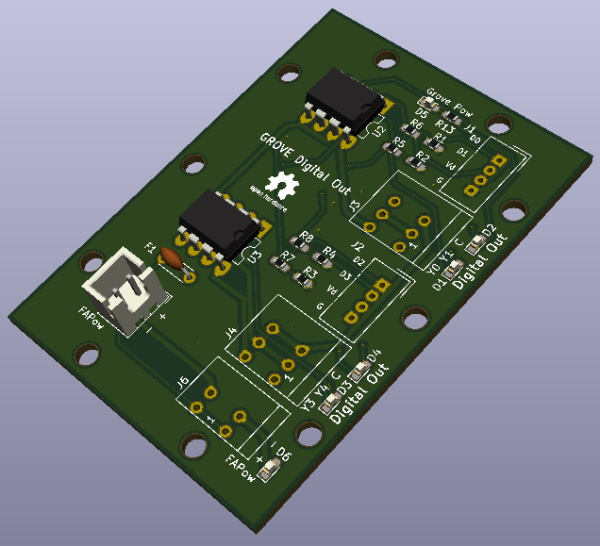
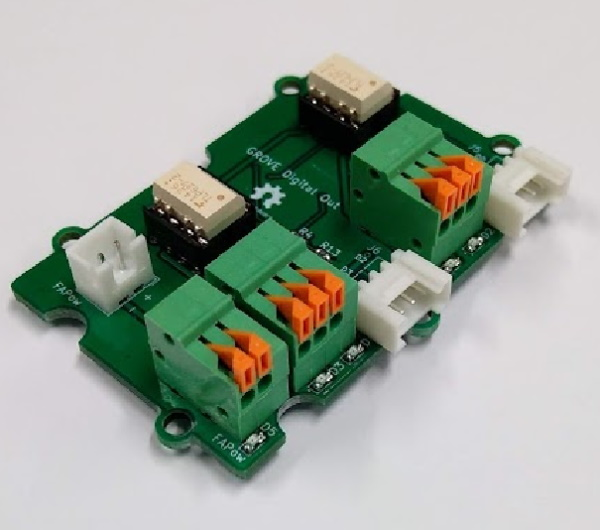

# Digital Output 4ch

Digital Output for GROVE Digital.
Isolated outputs.

[Schematic](./img/DigitalOutput4ch.pdf)

**Notes**

Please import this library before using this repository.
https://github.com/trihome/KiCad_MyLibrary

## 1.Spec

- 4 isolated outputs.
- [GROVE Digital](https://wiki.seeedstudio.com/Grove_System/#digital) Connector x 2 (2ch x 2 = 4ch)
- Supply 24V power to J5 or J6.
- J3,6 are Input for FA(24V)
  - Recommended Terminal block: [2pin](https://akizukidenshi.com/catalog/g/gP-06307/), [3pin](https://akizukidenshi.com/catalog/g/gP-06308/)
- Selectable Sink(NPN) / Source(PNP) : JP1, JP2
- U1,2,3,4: Photocoupler, you have to choose...

|JP1, JP2|Photocoupler (ex)|
|:--|:--|
|N : Sink(NPN)|[TLP222A](https://akizukidenshi.com/catalog/g/gI-07672/), [TLP627](https://akizukidenshi.com/catalog/g/gI-07691/)|
|P : Source(PNP)|[TLP222A](https://akizukidenshi.com/catalog/g/gI-07672/)|

## 2.Example of use

<!--
### (1)Terminal block

- Button
  - [IDEC](http://jp.idec.com/ja/p/c10/)
  - [OMRON](https://www.fa.omron.co.jp/products/category/switches/push-buttons_indicator-lamps/)
- Lamp
  - [NIKKEI MFG](http://www.nikkei-mfg.co.jp/product/industry/index.htm)
-->
