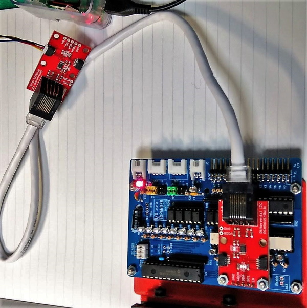

# IO Expander 16ch

IO Expander for GROVE I2C.
Isolated inputs and outputs.

[Schematic](./img/IOExpander16ch.pdf)

**Notes**

Please import this library before using this repository.
https://github.com/trihome/KiCad_MyLibrary

## 1.Spec

- 8 isolated inputs and 8 isolated outputs.
- I/O Expander : MCP23017
  - Select I2C address, J4,J5,J6.
  - I2C signal input to J7 (GROVE I2C).
  - INT A, B Pins are output to J8 (GROVE Digital).
- Supply 24V power to J3.
- J1 is Input / Output for FA(24V)
  - Recommended [Terminal block](https://www.togi.co.jp/product/interface/1072/) and [Cables](https://www.togi.co.jp/product/harness-cable/2661/) or QI(2550)connectors.
- Selectable Sink(NPN) / Source(PNP) : J9(Input), J10(Output)
  - IC1: Transistor array, you have to choose.
    - J10 = [Sink(NPN)](http://akizukidenshi.com/catalog/g/gI-10669/)
    - J10 = [Source(PNP)](http://akizukidenshi.com/catalog/g/gI-10957/)
- If you want to communicate with a distant location, add this board.
- [SparkFun Differential I2C Breakout - PCA9615](https://www.switch-science.com/catalog/3907/)

## 2.Example of use

### (1)Terminal block

- Terminal block (34 pin)
  - [Screw connection](https://www.togi.co.jp/product/interface/958/)
  - [Push-in connection(Ferrules)](https://www.togi.co.jp/product/interface/1086)
- [Cables](https://www.togi.co.jp/series/harness-cable/284/)
- Button
  - [IDEC](http://jp.idec.com/ja/p/c10/)
  - [OMRON](https://www.fa.omron.co.jp/products/category/switches/push-buttons_indicator-lamps/)
- Lamp
  - [NIKKEI MFG](http://www.nikkei-mfg.co.jp/product/industry/index.htm)

### (2)Communicate with a device in a remote location

- [SparkFun Differential I2C Breakout - PCA9615](https://www.switch-science.com/catalog/3907/)
  - Connect to J12.
- Ethernet Cables (MAX 30 m)

